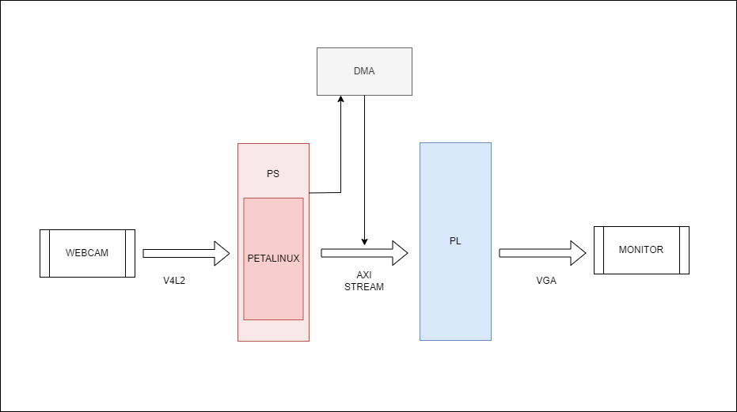
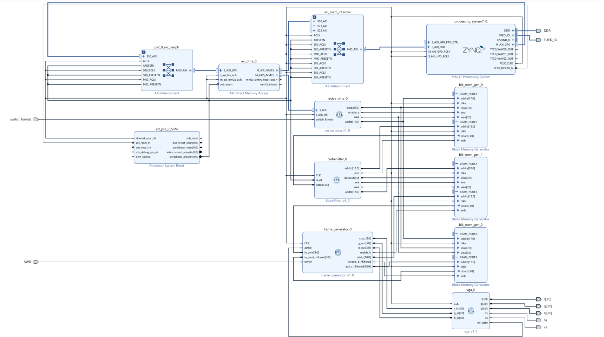
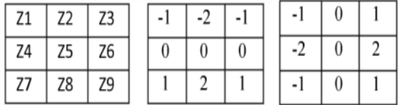
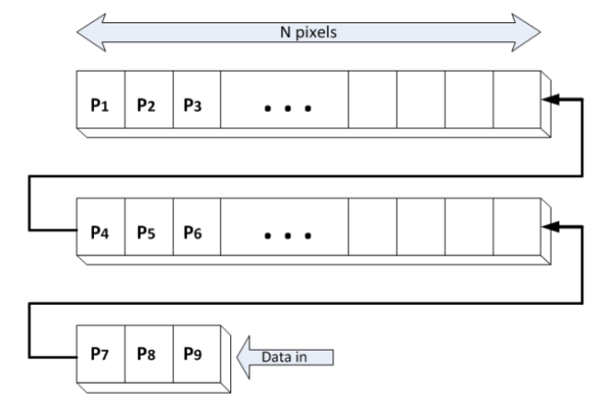
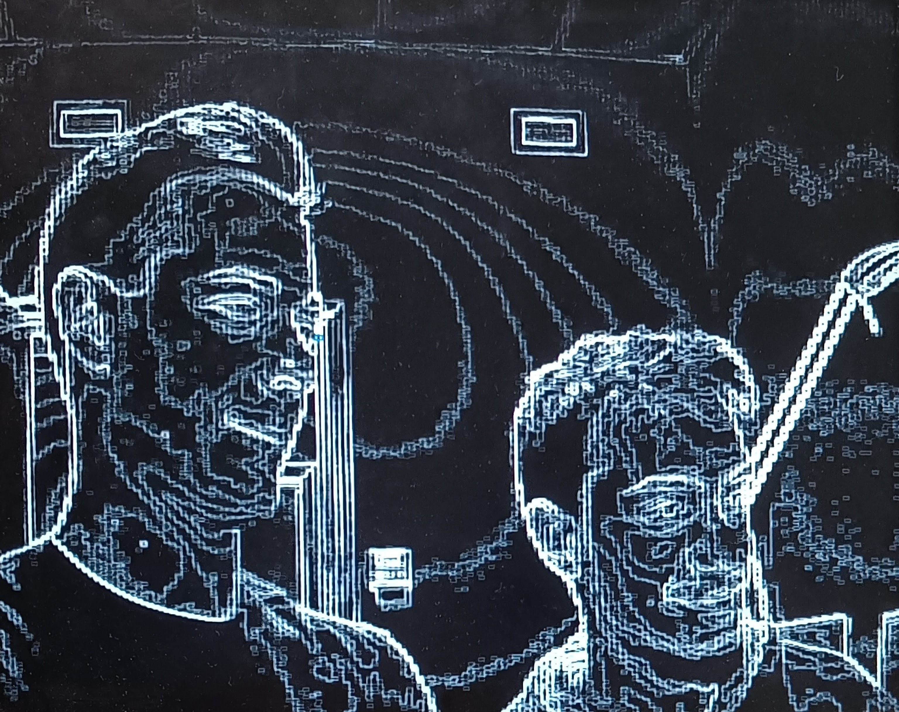

# <strong> FPGA Video Processing </strong>
Xilinx Zedboard-based system for video acquisition from a USB webcam using Petalinux. PL implementation of video processing with Sobel filter and VGA video output.

<a name="index"></a>
# <strong> Table of Contents </strong>
1. <a href="#requirementslist">Requirements</a></br>
&nbsp;&nbsp;&nbsp;&nbsp; 1.1 <a href="#hwrequirements">Hardware Requirements</a></br>
&nbsp;&nbsp;&nbsp;&nbsp; 1.2 <a href="#swrequirements">Software Requirements</a></br>
2. <a href="#layoutlist">Project Layout</a></br>
3. <a href="#startlist">Getting Started</a></br>
4. <a href="#projectsteps">Project steps</a></br>
&nbsp;&nbsp;&nbsp;&nbsp; 4.2 <a href="#vivadohw">Vivado Hardware Design</a></br>
&nbsp;&nbsp;&nbsp;&nbsp; 4.1 <a href="#petalinux">PetaLinux build</a></br>
&nbsp;&nbsp;&nbsp;&nbsp; 4.3 <a href="#vitissw">Code for Zynq processor</a></br>
5. <a href="#video">Video</a></br>
6. <a href="#teamlist">Team Members</a></br>
7. <a href="#referencelist">References</a></br>

<a name="requirementslist"></a>
# **Requirements**
<a name="hwrequirements"></a>
## Hardware Requirements

- [FPGA Xilinx Zedboard](https://www.xilinx.com/products/boards-and-kits/1-8dyf-11.html);
- USB Webcam;
- SD card (8 GB minimum);
- Monitor with VGA port and VGA cable;
- USB cable and USB A to micro adapter;
- Ethernet cable;

<a name="swrequirements"></a>
## Software Requirements
- [Vivado 2021.2](https://www.xilinx.com/support/download/index.html/content/xilinx/en/downloadNav/vivado-design-tools/archive.html);
- Vitis 2021.2;
- [PetaLinux tools 2021.2](https://www.xilinx.com/products/design-tools/embedded-software/petalinux-sdk.html);
- Ubuntu 16.04;

<a name="layoutlist"></a>
# **Project Layout**
The system is composed of three main parts: Zedboard, webcam and monitor. These parts are connected all together to perform video capturing, filtering and show the results on a monitor via VGA. A switch, the first on the right of the FPGA board, is used to choose which image to display, between the original greyscale image and the filtered image. </br>

<p align="center"></p>

The project layout is pretty straightforward: webcam data is captured by the processor through the v4l2 kernel running on PetaLinux. Data saved in memory is then transferred to Programmable Logic (PL) through the use of DMA on an AXI-Stream bus. Finally, the FPGA architecture processes the image, managing the format and applying a Sobel filter to then drive the VGA to display the video. </br>

<a name="startlist"></a>
# **Getting Started**
The following steps are needed to make the system work:
- with a tool like gparted, divide the SD card in three different partitions: a 4MB free space at the beginning, a 500MB FAT32 partition as BOOT and the remaining part in ext4 as rootfs;
- from the petalinux_files/ directory, copy the BOOT.BIN, boot.scr and image.ub files in the BOOT partition and from this [link](https://drive.google.com/drive/folders/1RzFJCgQ1HQrXdmVkEm8N4Z-CmbkjK4yV?usp=sharing) unzip the rootfs.tar.gz in the rootfs partition;
- insert the SD card in the Zedboard, and connect it wih a computer via the COM connection;
- connect the webcam and the monitor to the Zedboard;
- in the PetaLinux terminal run the commands <code>sh load_hw.sh</code> and <code>sh start.sh</code> and the system should start;
- you might have to use the switch on the left of the Zedboard to set the right video visualization, depending on the video encoding of your webcam.

 <p align="center"></p>

<a name="projectsteps"></a>
# **Project steps**
The following part explains our steps to develop the system from scratch.
<a name="vivadohw"></a>
## **Vivado Hardware Design**
<p align="center"></p>

The diagram shows the architecture we developed, where we can identify the main blocks:
- **ZYNQ processor** (*processing_system7_0*);
- **Axi DMA** (*axi_dma_0*);
- image processing block composed of **receive dma** ([*recive_dma_0*](vivado_files/Receive_dma.vhd)) and **Sobel filter** ([*SobelFilter_0*](vivado_files/SobelFilter.vhd)); 
- image visualization block composed of **frame generator** ([*frame_generator_0*](vivado_files/Frame_generator.vhd)) and **VGA driver** (*vga_0*);
- **memory blocks** (*blk_mem_gen_0, blk_mem_gen_1, blk_mem_gen_2*).

The data flow starts from the *processor* which via embedded code handles the DMA and transfers the image via AXI-Stream to the *receive dma* block. Here the data is converted from the **YUY2 webcam format** to 4 bits greyscale. Then the image is saved and passed to the next block that implements the **Sobel filter**, the image processing core that through an algorithm highlights the edges of a figure within the image. Finally, the *frame generator* block is responsible for creating the frame and handling synchronization with the *VGA driver* after applying a frame that indicates the recognition of a figure. </br>

Three *memory blocks* necessary to save partial results after each processing are provided in the architecture so as to simplify synchronization and management of the image shown on the screen. To avoid concurrency problems between the *Sobel filter* block and *frame generator* block, *memory block 2* is added, allowing access to the original image at any time. </br>

### **Receive DMA block**
This block handles the format of the incoming data from the DMA. On input we get a 32 bits data which corresponds to two pixels encoded in **YUY2**. From this bit array the two bytes related to **brightness** are extracted and then only the most significant 4 bits of each byte are actually transferred. To handle the different order of the input bytes due to variations in the image format, a switch has been added to allow the choice between two different configurations. Data is then passed out in groups of two pixels encoded in **greyscale 4 bits** (one byte total). </br>

### **Sobel filter**
This is the block designated to implement the Sobel filter. Two **3×3 kernels**, or convolution matrices, are applied to the original image to compute approximate values of the **horizontal and vertical gradients**. From the original image, 2 rows are stored in 2 arrays, and a third array is used to store an additional 3 pixels. In this way, by simply shifting the three arrays by one pixel, one always manages to have in the first three array positions the correct pixels on which to apply the kernel. Again the image is stored in a BRAM for the next step.
<p align="center"></p>
<p align="center"></p>

### **Frame generator block**
In this block the **partial sums** of the filtered image are calculated and used to estimate the box in which the figure is contained. The partial sums of each row and column are saved in two arrays. The index of the two largest values in each array will indicate the boundary rows and columns of the figure, on which to then plot the box. Timing for frame generation in sync with the VGA driver is also handled, which using the *on state* signal enables or disables image transmission.

The complete Vivado project can be downloaded from this [link](https://drive.google.com/drive/folders/1RzFJCgQ1HQrXdmVkEm8N4Z-CmbkjK4yV?usp=sharing), or recreated importing in a new Vivado project the .xci and .bd files, that can be found in the vivado_files/ directory.

<a name="petalinux"></a>
## **PetaLinux build**
The following section shows the steps we took to create a PetaLinux image with the kernels and other options needed to run the project.
Our choices were based primarily on the guides at the bottom of this document, along with the official PetaLinux [guide](https://docs.xilinx.com/r/2021.2-English/ug1144-petalinux-tools-reference-guide/Overview) from Xilinx.
These steps must be performed on a Linux (we used Ubuntu 16.04) computer.
- Install PetaLinux Tools from the official [site](https://www.xilinx.com/products/design-tools/embedded-software/petalinux-sdk.html);
- source the path of PetaLinux with <code>source petalinux/\<version>/settings.sh</code>;
- create the PetaLinux project with <code>petalinux-create --type project --template zynq --name \<PROJECT NAME\></code>;
- run <code>petalinux-config --get-hw-description \<PATH TO XSA FILE\></code> with the path to the .xsa file generated by Vivado;
- execute <code>petalinux-config</code> and select the following options from the pop-up window to configure the project:
  - Image packaging configuration -> root file system type -> Ext4(SD)
  - Yocto settings -> Yocto board settings -> yocto borad name -> "zedboard"

- Now execute <code>petalinux-config -c kernel</code> and make sure to activate the following options. Some of these options are not strictly necessary, but have been included to have some extra features that may come in handy in later stages.
- Under **Device drivers -> USB support** activate:
  - USB support -> USB ULPI PHY interface support
  - USB support -> EHCI HCD (USB 2.0) support
  - USB support -> ChipIdea Highspeed Dual Role Controller
  - USB support -> ChipIdea device controller
  - USB support -> ChipIdea host controller
  - USB support -> USB Gadget Support
- Under **USB support -> USB Gadget Support**:
  - USB Gadget Support -> USB Gadget functions configurable through configfs (M)
  - USB Gadget Support -> Network control model
  - USB Gadget Support -> Mass Storage
  - USB Gadget Support -> USB webcam function  
- Under **USB Gadget Support -> USB precomposed configurations**:
  - USB precomposed configurations -> Gadget Zero (M)
  - USB precomposed configurations -> Network control model
  - USB precomposed configurations -> Mass storage (M)
  - USB precomposed configurations -> Multifunction composit gadget (M)
  - USB precomposed configurations ->  RNDIS + CDC serial + storage configuration
  - USB precomposed configurations ->  CDC ethernet + CDC serial + Storage configuration
  - USB precomposed configurations ->  USB Webcam Gadget (M)
- And more in:
  - Device Drivers -> Multimedia Support  -> Media Core Support -> Video4linux core and -> Media control API
  - Device Drivers -> Multimedia Support -> video4linux options -> V4l2 sub-device userspace API
  - Device Drivers -> Multimedia Support -> media drivers -> media USB adapters -> USB video Class (M) and UVC input events device support
  - Device Drivers -> Multimedia Support -> media drivers -> media USB adapters -> V4l platform devices
  - Device Drivers -> Graphics Support ->  Xilinx DRM KMS Driver
  - Device Drivers -> FPGA Configuration Framework -> Xilinx Zynq FPGA
- Now execute <code>petalinux-config -c rootfs</code> and select:
  - Filesystem Packages -> multimedia -> gstreamer1.0
  - Filesystem Packages -> x11 -> base -> libdrm
  - Filesystem Packages -> x11 -> base -> xserver-xorg
  - Filesystem Packages -> x11 -> base -> xserver-xorg
  - Filesystem Packages -> x11 -> wm -> matchbox-desktop
  - Filesystem Packages -> x11 -> wm -> matchbox-wm
  - Petalinux Package Groups -> packagegroup-petalinux-opencv -> all options
  - Petalinux Package Groups -> packagegroup-petalinux-v4lutils -> all options
  - Petalinux Package Groups -> packagegroup-petalinux-x11 -> all options
 
- finally generate the PetaLinux image with <code>petalinux-build -c device-tree</code> and <code>petalinux-build</code>;
- use <code>petalinux-package --boot --format BIN --fsbl images/linux/zynq_fsbl.elf --fpga images/linux/BOOT.bit --u-boot</code> to generate the BOOT.BIN file.
  
All files needed to boot PetaLinux, to be copied inside the SD card as explained in the Getting Started section, can be found in <code>\<project path>/images/linux</code>.
 
### **Update PL from PetaLinux at run time**
- Get the bitstream file (.bit) from Vivado;
- From a linux environment with Vivado installed run in a command shell <code> $ source <vivado_install_dir>/settings64.sh </code>;
- Create a txt file with the following content: 
``` txt
all:
{
    ./<Bitstream_name>.bit
}
```
- Change the name of the file from \<name>.txt to \<name>.bif;
- Run in command shell at the same directory of the \<name>.bif <code> bootgen -image <Input_file>.bif -arch zynq -process_bitstream bin -o ./<Output_file>.bin -w </code>;
- Copy \<name>.bit.bin file just created in the BOOT partition on the SD card;
- Turn on Petalinux on the FPGA board and run the following commands
``` bash
 echo 0 > /sys/class/fpga_manager/fpga0/flags
 mkdir -p /lib/firmware
 mount /dev/mmcblk0p1 /media/
 cp /media/design_1_wrapper.bit.bin /lib/firmware/
 echo design_1_wrapper.bit.bin > /sys/class/fpga_manager/fpga0/firmware
``` 
For more information look at this [link](https://xilinx-wiki.atlassian.net/wiki/spaces/A/pages/18841847/Solution+ZynqMP+PL+Programming)
 
<a name="vitissw"></a>
## **Code for Zynq processor**
The acquisition and transfer of the image into the PS are handled by the [***webcam_to_PL.c***](https://github.com/giuseppewebber/FPGA_video_processing/blob/main/c_code/webcam_to_PL.c) code. Through the use of the **v4l2 kernel**, the processor interfaces with the webcam by managing its registers and buffers and then transfers the acquired data to the PL by driving the **DMA driver**.
The code is run on PetaLinux, a Linux-based OS for embedded systems, which is necessary to take advantage of the capabilities of the v4l2 kernel. However, this involves adding an **abstraction layer** that complicates memory address management and communication with the PL.
The code we implemented takes inspiration from two different examples found online, [***capture.c***](https://www.kernel.org/doc/html/v4.9/media/uapi/v4l/capture.c.html) for the proper use of v4l2 and [***dmatest.c***](https://www.hackster.io/whitney-knitter/introduction-to-using-axi-dma-in-embedded-linux-5264ec#code) for the DMA driver, which we have included in this directory. </br>
Next are some sections of code that play an important role in the operation of the system. </br>

### ***transfer_dma()***
In this section we deal with data transfer via DMA. Data is divided into N blocks of size equal to ***transfer_lenght***, defined by choosing a value smaller than the max transfer lenght of the DMA (equal to 16384) and that divide the image into an integer N number. N transfers are then performed for each frame.

```c
void transfer_dma(volatile unsigned int *dma_virtual_addr, unsigned int phisical_address, unsigned int size){
    // divide image in N blocks to stream less than maximum bytes number
    int i = 0;
    int N = (int)(size/transfer_lenght);

    for(i=0; i<N; i++){
        //  Halt the DMA
        write_dma(dma_virtual_addr, MM2S_CONTROL_REGISTER, HALT_DMA);

        //  Writing source address of the data from MM2S in DDR
        write_dma(dma_virtual_addr, MM2S_SRC_ADDRESS_REGISTER, (phisical_address+(i*transfert_lenght)));

        //  Run the MM2S channel
        write_dma(dma_virtual_addr, MM2S_CONTROL_REGISTER, RUN_DMA);

        //  Writing MM2S transfer length of transfert_lenght  bytes
        write_dma(dma_virtual_addr, MM2S_TRNSFR_LENGTH_REGISTER, transfert_lenght);

        //  Waiting for MM2S synchronization
        dma_mm2s_sync(dma_virtual_addr);
    }
}
```
             
### ***initdma()***
This function initializes the DMA and takes care of mapping via ***mmap()*** the control registers and the memory area used for data transfer.
In order to access the physical addresses of the memory, we use /dev/mem to create a ***file descriptor*** that allows the memory to be accessed from PetaLinux.
We then map the physical addresses of the DMA given in **Vivado Address Editor** so they can be used by our application.
```c
void initdma(){
        printf("Running DMA transfer.\n");

        //  Opening a character device file of the Zynq's DDR memory with aligned page
        int ddr_memory = open("/dev/mem", O_RDWR | O_SYNC);
        unsigned pagesize = sysconf(_SC_PAGESIZE);

        //  Memory map the address of the DMA AXI IP via its AXI lite control interface register block
        dma_virtual_addr = mmap(NULL, pagesize, PROT_READ | PROT_WRITE, MAP_SHARED, ddr_memory, 0x40400000);

        //  Memory map the MM2S source address register block
        virtual_src_addr  = mmap(NULL, imageSize*2, PROT_READ | PROT_WRITE, MAP_SHARED, ddr_memory, 0x0e000000);

        //  Reset the DMA
        write_dma(dma_virtual_addr, MM2S_CONTROL_REGISTER, RESET_DMA);

        //  Halt the DMA
        write_dma(dma_virtual_addr, MM2S_CONTROL_REGISTER, HALT_DMA);

        //  Enable all interrupts
        write_dma(dma_virtual_addr, MM2S_CONTROL_REGISTER, ENABLE_ALL_IRQ);
}
```
    
### ***process_image()***
***process_image()*** is the main function for code operation. In this part of the code we copy data from the webcam registers, previously mapped in memory, to the memory locations used for transfer mapped in the ***init_dma()*** function. 
We point out the use of the ***volatile*** attribute to prevent the compiler from optimizing the use of memory allocated for saving the image.
```c
static void process_image(volatile const void *p, int size){
    int i = 0;
    int j = size/4;

        for (i = 0; i < j; i++){
            virtual_src_addr[i] = *(((volatile unsigned int *)p)+i);
        }
        transfer_dma(dma_virtual_addr, DMA_SRC_ADDRESS, size);
}        
```
 
### Debug
Code development for video handling was done in Vitis IDE after building a Linux platform based on our architecture, allowing code to be **loaded on the board and debugged**. A guide on how to build the platform and debug is provided at this
[link](https://www.xilinx.com/video/software/building-linux-application-vitis.html#links-collapse).
 
<a name="video"></a>
## Video Demo
https://github.com/giuseppewebber/FPGA_video_processing/blob/main/readm_img/Video_demo.mp4

<a name="teamlist"></a>
## Team Members
 - Giovanni Solfa
 - Giuseppe Webber
 
<p align="center"></p>

<a name="referencelist"></a>
# References
Shraddha Y. Swami, Jayashree S. Awati, (2017) " Implementation of Edge Detection Filter using FPGA ", International Journal of Electrical, Electronics and Data Communication (IJEEDC), pp. 83-87, Volume-5, Issue-6

# Link
- [YUV format](https://www.kernel.org/doc/html/v4.9/media/uapi/v4l/pixfmt-yuyv.html)
- [YUV format 2](https://linuxtv.org/downloads/v4l-dvb-apis-new/userspace-api/v4l/pixfmt-packed-yuv.html?highlight=v4l2_pix_fmt_yuyv)
- [Xilinx documentation](https://docs.xilinx.com/)
- [Petalinux Guide - 1](https://medium.com/developments-and-implementations-on-zynq-7000-ap/install-ubuntu-16-04-lts-on-zynq-zc702-using-petalinux-2016-4-e1da902eaff7)
- [Petalinux Guide - 2](https://medium.com/developments-and-implementations-on-zynq-7000-ap/interfacing-a-usb-webcam-and-enable-usb-tethering-on-zynq-7000-ap-soc-running-linux-1ba6d836749d)
- [Petalinux Guide - 3](https://enes-goktas.medium.com/install-and-run-ubuntu-20-04-on-zynq-7000-soc-zc706-evaluation-board-c5fef2423c98)
